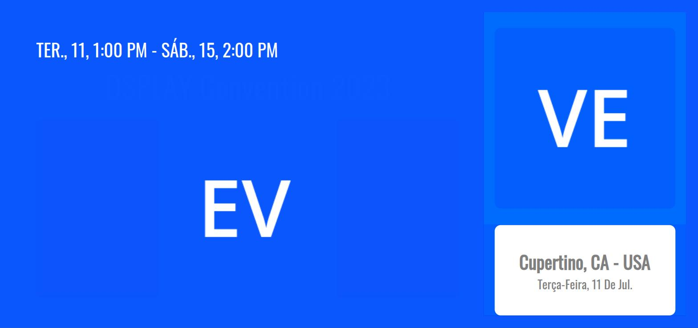
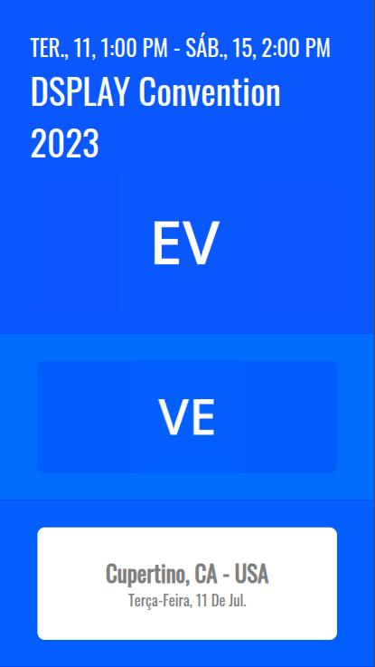

# DSPLAY - Meeting Room Template

A [React](https://reactjs.org/) [HTML-based template](https://developers.dsplay.tv/docs/html-templates) for the [DSPLAY - Digital Signage](https://dsplay.tv/) platform — shows an event's name, schedule, location, and host/event branding outside a meeting room.

> Built with [Vite](https://vitejs.dev/), requires Node.js 22.22.2+, 24.15.0+, or 26+ (see `.nvmrc`).

## Supported screen formats

| Landscape | Portrait |
|-----------|----------|
|  |  |

Square, horizontal banner, and vertical banner aren't supported — the layout only defines styles for `landscape`/`portrait`, so other screen formats fall back to unstyled block flow and overflow badly.

## Template variables

| Key                 | Type   | Description                                                                                     |
|---------------------|--------|---------------------------------------------------------------------------------------------------|
| `eventLogo`         | string | Event logo image (required). Its dominant color is used as its card's background.                |
| `hostLogo`          | string | Host/venue logo image (required). Its dominant color is used as its card's background.            |
| `mainColor`         | string | Background color behind the whole template.                                                       |
| `rightColorTop`     | string | Background color of the host logo's panel.                                                        |
| `rightColorBottom`  | string | Background color of the location/date panel.                                                      |

The event's name, location, and start/end dates come from the media's own data (`dsplay_media.eventName`/`location`/`startDate`/`endDate`), not from a Template Var — see `public/dsplay-data.js` for the local mock.

> Remember to also register the Template Vars above (same name and type) when configuring this template in the DSPLAY CMS.

## Local development

```sh
npm install
npm start
```

`public/dsplay-data.js` defines `dsplay_config`/`dsplay_media`/`dsplay_template` mock globals used only when the template isn't running inside the actual DSPLAY app. Edit it to try out different events/branding — the DSPLAY Player App replaces it with real content at runtime.

## Packing (release build)

```sh
npm run zip
```

This builds the template with Vite, which also generates `template-variables.json` + `template-example-data.json` (via [@dsplay/template-manifest](https://www.npmjs.com/package/@dsplay/template-manifest)'s Vite plugin) — the DSPLAY CMS reads these two files to auto-detect this template's variables and seed default preview values. It then generates `template.zip`, ready to be deployed to the [DSPLAY Web Manager](https://manager.dsplay.tv/template/create).

## Test assets

To use test assets (images, videos, etc) during development, put them in the `public/test-assets` folder and reference them in `dsplay-data.js` using their relative path. `public/test-assets` is automatically excluded from the release build.

## Maintaining dependencies

Regular npm dependencies, not vendored files:

```sh
npm outdated
npm update
```

For a version outside the declared range (typically a major bump), apply it deliberately and verify `npm start`, `npm run build`, and `npm test` still work before committing.

### Commit conventions

See [AGENTS.md](AGENTS.md).

## More

To see more about DSPLAY HTML Templates, visit: https://developers.dsplay.tv/docs/html-templates
